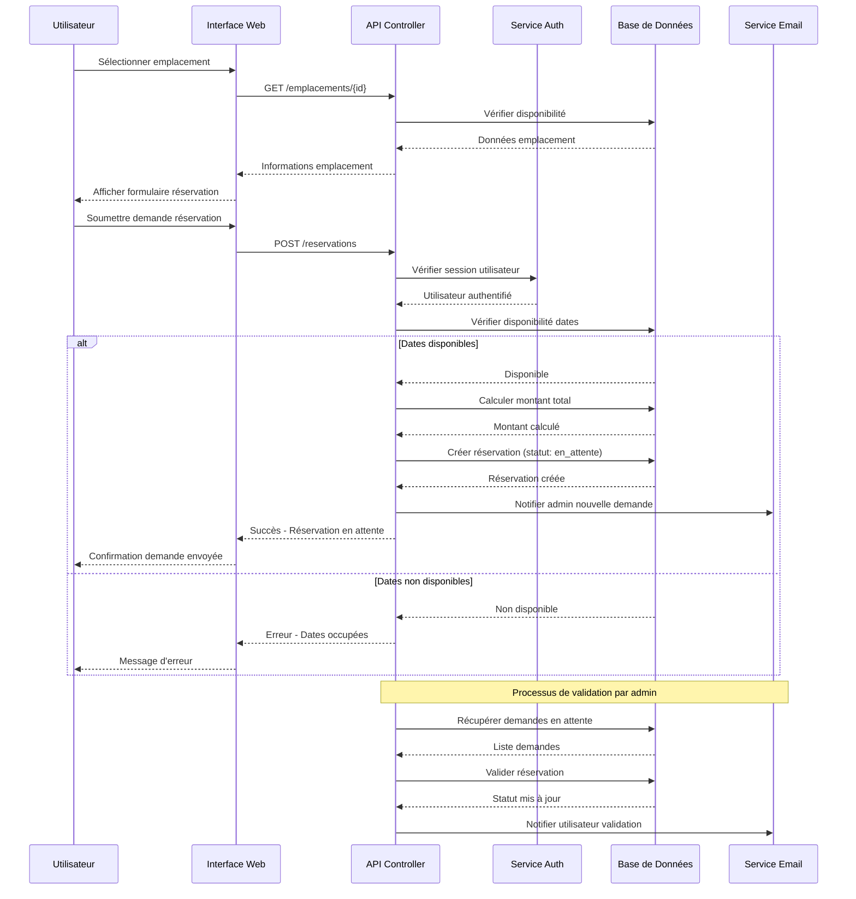
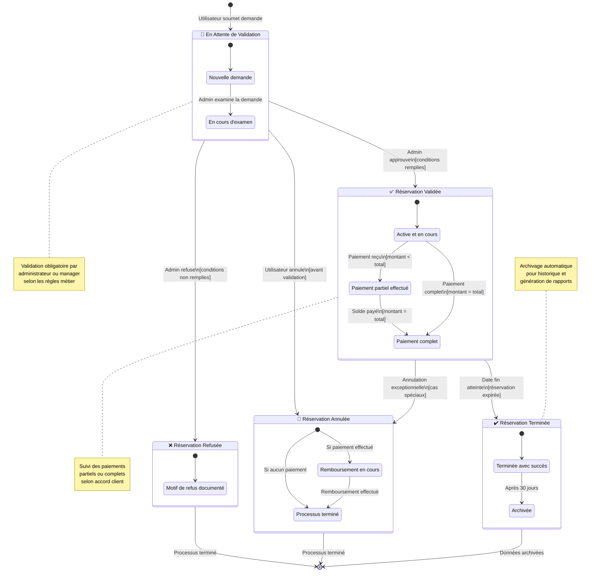
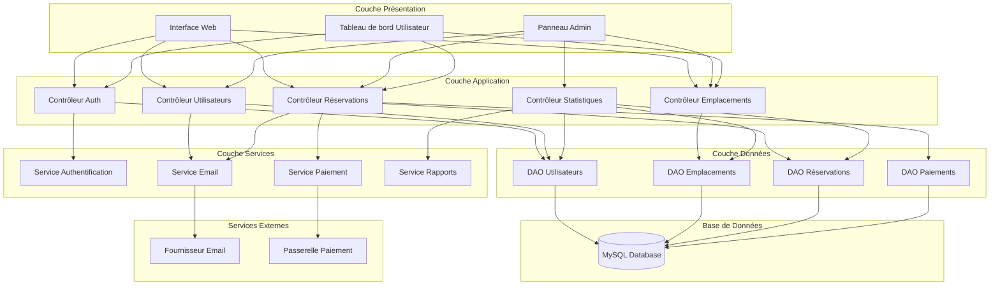
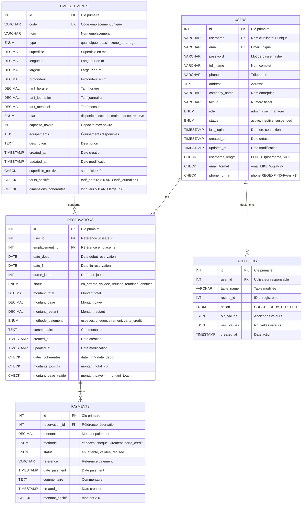

# Documentation UML - Système de Gestion des Emplacements Portuaires Marsa Maroc

## Table des Matières

1. [Diagramme de Cas d'Usage](#1-diagramme-de-cas-dusage)
2. [Diagramme de Classes](#2-diagramme-de-classes)
3. [Diagramme de Séquence](#3-diagramme-de-séquence)
4. [Diagramme d'États](#4-diagramme-détats)
5. [Diagramme d'Activité](#5-diagramme-dactivité)
6. [Diagramme de Composants](#6-diagramme-de-composants)
7. [Diagramme Entité-Relation](#7-diagramme-entité-relation)

---

## 1. Diagramme de Cas d'Usage

**Description**: Représentation des interactions entre les différents acteurs et le système de gestion portuaire.

```mermaid
flowchart LR
    %% Acteurs à gauche
    subgraph Acteurs
        Admin[👤 Administrateur]
        Manager[👤 Manager] 
        User[👤 Utilisateur]
    end
    
    %% Système au centre
    subgraph System["🏢 Système de Gestion Portuaire Marsa Maroc"]
        
        subgraph Auth["🔐 Authentification"]
            UC1((Se connecter))
            UC2((Se déconnecter))
        end
        
        subgraph Emplacements["🚢 Gestion Emplacements"]
            UC3((Consulter emplacements))
            UC4((Ajouter emplacement))
            UC5((Modifier emplacement))
            UC6((Supprimer emplacement))
            UC7((Changer état))
        end
        
        subgraph Reservations["📋 Gestion Réservations"]
            UC8((Demander réservation))
            UC9((Consulter réservations))
            UC10((Valider réservation))
            UC11((Refuser réservation))
            UC12((Annuler réservation))
        end
        
        subgraph Users["👥 Gestion Utilisateurs"]
            UC13((Consulter profil))
            UC14((Modifier profil))
            UC15((Créer utilisateur))
            UC16((Modifier utilisateur))
            UC17((Supprimer utilisateur))
        end
        
        subgraph Stats["📊 Statistiques"]
            UC18((Consulter statistiques))
            UC19((Générer rapports))
        end
    end
    
    %% Relations Administrateur (accès complet)
    Admin --- UC1
    Admin --- UC2
    Admin --- UC3
    Admin --- UC4
    Admin --- UC5
    Admin --- UC6
    Admin --- UC7
    Admin --- UC9
    Admin --- UC10
    Admin --- UC11
    Admin --- UC13
    Admin --- UC14
    Admin --- UC15
    Admin --- UC16
    Admin --- UC17
    Admin --- UC18
    Admin --- UC19
    
    %% Relations Manager (accès limité)
    Manager --- UC1
    Manager --- UC2
    Manager --- UC3
    Manager --- UC7
    Manager --- UC9
    Manager --- UC10
    Manager --- UC11
    Manager --- UC13
    Manager --- UC14
    Manager --- UC18
    
    %% Relations Utilisateur (accès minimal)
    User --- UC1
    User --- UC2
    User --- UC3
    User --- UC8
    User --- UC9
    User --- UC12
    User --- UC13
    User --- UC14
    
    %% Styles
    classDef actor fill:#e1f5fe,stroke:#01579b,stroke-width:2px
    classDef usecase fill:#f3e5f5,stroke:#4a148c,stroke-width:2px
    classDef system fill:#e8f5e8,stroke:#1b5e20,stroke-width:2px
    
    class Admin,Manager,User actor
    class UC1,UC2,UC3,UC4,UC5,UC6,UC7,UC8,UC9,UC10,UC11,UC12,UC13,UC14,UC15,UC16,UC17,UC18,UC19 usecase
```



---

## 2. Diagramme de Classes

**Description**: Structure des classes principales du système avec leurs attributs, méthodes et relations.

```mermaid
classDiagram
    class User {
        -int id
        -string username
        -string email
        -string password
        -string full_name
        -string phone
        -string address
        -string company_name
        -string tax_id
        -UserRole role
        -UserStatus status
        -datetime last_login
        -datetime created_at
        -datetime updated_at
        +login() bool
        +logout() void
        +updateProfile() bool
        +getReservations() Reservation[]
    }
    
    class Emplacement {
        -int id
        -string code
        -string nom
        -EmplacementType type
        -decimal superficie
        -decimal longueur
        -decimal largeur
        -decimal profondeur
        -decimal tarif_horaire
        -decimal tarif_journalier
        -decimal tarif_mensuel
        -EmplacementEtat etat
        -int capacite_navire
        -string equipements
        -string description
        -datetime created_at
        -datetime updated_at
        +isAvailable() bool
        +calculateCost(duration) decimal
        +changeState(newState) void
        +getReservations() Reservation[]
    }
    
    class Reservation {
        -int id
        -int user_id
        -int emplacement_id
        -date date_debut
        -date date_fin
        -int duree_jours
        -ReservationStatut statut
        -decimal montant_total
        -decimal montant_paye
        -decimal montant_restant
        -PaymentMethod methode_paiement
        -string commentaire
        -datetime created_at
        -datetime updated_at
        +calculateDuration() int
        +calculateAmount() decimal
        +validate() bool
        +refuse() bool
        +cancel() bool
        +addPayment(amount) bool
    }
    
    class Payment {
        -int id
        -int reservation_id
        -decimal montant
        -PaymentMethod methode
        -PaymentStatus statut
        -string reference
        -datetime date_paiement
        -string commentaire
        +process() bool
        +refund() bool
    }
    
    %% Énumérations
    class UserRole {
        <<enumeration>>
        ADMIN
        USER
        MANAGER
    }
    
    class UserStatus {
        <<enumeration>>
        ACTIVE
        INACTIVE
        SUSPENDED
    }
    
    class EmplacementType {
        <<enumeration>>
        QUAI
        DIGUE
        BASSIN
        ZONE_AMARRAGE
    }
    
    class EmplacementEtat {
        <<enumeration>>
        DISPONIBLE
        OCCUPE
        MAINTENANCE
        RESERVE
    }
    
    class ReservationStatut {
        <<enumeration>>
        EN_ATTENTE
        VALIDEE
        REFUSEE
        TERMINEE
        ANNULEE
    }
    
    class PaymentMethod {
        <<enumeration>>
        ESPECES
        CHEQUE
        VIREMENT
        CARTE_CREDIT
    }
    
    class PaymentStatus {
        <<enumeration>>
        EN_ATTENTE
        VALIDEE
        REFUSEE
    }
    
    %% Relations
    User ||--o{ Reservation : fait
    Emplacement ||--o{ Reservation : concerne
    Reservation ||--o{ Payment : génère
    User }o--|| UserRole : a
    User }o--|| UserStatus : a
    Emplacement }o--|| EmplacementType : est
    Emplacement }o--|| EmplacementEtat : dans
    Reservation }o--|| ReservationStatut : a
    Payment }o--|| PaymentMethod : utilise
    Payment }o--|| PaymentStatus : a
```

---

## 3. Diagramme de Séquence

**Description**: Processus de création d'une réservation avec validation.



---

## 4. Diagramme d'États

**Description**: États et transitions des réservations dans le système.



---

## 5. Diagramme d'Activité

**Description**: Processus complet de gestion d'une demande de réservation.

```mermaid
flowchart TD
    Start([Début: Nouvelle demande]) --> CheckAuth{Utilisateur connecté?}
    CheckAuth -->|Non| Login[Page de connexion]
    Login --> CheckAuth
    CheckAuth -->|Oui| SelectLocation[Sélectionner emplacement]
    
    SelectLocation --> CheckAvailability{Emplacement disponible?}
    CheckAvailability -->|Non| ShowError[Afficher message d'erreur]
    ShowError --> SelectLocation
    
    CheckAvailability -->|Oui| FillForm[Remplir formulaire réservation]
    FillForm --> ValidateForm{Formulaire valide?}
    ValidateForm -->|Non| ShowValidationError[Afficher erreurs validation]
    ShowValidationError --> FillForm
    
    ValidateForm -->|Oui| SubmitRequest[Soumettre demande]
    SubmitRequest --> SaveToDB[(Sauvegarder en base)]
    SaveToDB --> NotifyAdmin[Notifier administrateur]
    NotifyAdmin --> ConfirmUser[Confirmer à l'utilisateur]
    
    ConfirmUser --> WaitValidation[Attente validation admin]
    WaitValidation --> AdminDecision{Décision admin}
    
    AdminDecision -->|Valider| ValidateReservation[Valider réservation]
    AdminDecision -->|Refuser| RefuseReservation[Refuser réservation]
    
    ValidateReservation --> UpdateStatus1[(Mettre à jour statut: VALIDEE)]
    UpdateStatus1 --> NotifyUserApproval[Notifier utilisateur - Approuvée]
    NotifyUserApproval --> ProcessPayment[Traiter paiement]
    
    RefuseReservation --> UpdateStatus2[(Mettre à jour statut: REFUSEE)]
    UpdateStatus2 --> NotifyUserRefusal[Notifier utilisateur - Refusée]
    NotifyUserRefusal --> End1([Fin: Demande refusée])
    
    ProcessPayment --> PaymentComplete{Paiement complet?}
    PaymentComplete -->|Non| PartialPayment[Paiement partiel]
    PaymentComplete -->|Oui| CompletePayment[Paiement complet]
    
    PartialPayment --> WaitRemainingPayment[Attendre solde]
    WaitRemainingPayment --> PaymentComplete
    
    CompletePayment --> StartReservation[Démarrer réservation]
    StartReservation --> MonitorReservation[Suivre réservation]
    MonitorReservation --> CheckEndDate{Date fin atteinte?}
    
    CheckEndDate -->|Non| MonitorReservation
    CheckEndDate -->|Oui| EndReservation[Terminer réservation]
    EndReservation --> UpdateStatus3[(Mettre à jour statut: TERMINEE)]
    UpdateStatus3 --> End2([Fin: Réservation terminée])
    
    %% Styles
    classDef startEnd fill:#90EE90
    classDef process fill:#87CEEB
    classDef decision fill:#FFB6C1
    classDef database fill:#DDA0DD
    
    class Start,End1,End2 startEnd
    class SelectLocation,FillForm,SubmitRequest,ValidateReservation,RefuseReservation,ProcessPayment,StartReservation,EndReservation process
    class CheckAuth,CheckAvailability,ValidateForm,AdminDecision,PaymentComplete,CheckEndDate decision
    class SaveToDB,UpdateStatus1,UpdateStatus2,UpdateStatus3 database
```



---

## 6. Diagramme de Composants

**Description**: Architecture des composants du système de gestion portuaire.



---

## 7. Diagramme Entité-Relation

**Description**: Modèle de données complet du système de gestion portuaire.



---

## Notes Techniques

### Compatibilité Mermaid

- **Version Mermaid**: Compatible avec mermaid.js v9.0.0+
- **Rendu GitHub**: Tous les diagrammes sont optimisés pour le rendu GitHub
- **Export**: Compatible avec mermaid.live pour export PDF/PNG
- **Syntaxe**: Utilisation de la syntaxe Mermaid standard sans extensions

### Conventions de Style

- **Classes CSS**: Styles intégrés pour une meilleure lisibilité
- **Couleurs**: Palette cohérente basée sur les types d'éléments
- **Flèches**: Types appropriés selon les relations (composition, agrégation, etc.)
- **Libellés**: En français conformément aux spécifications du projet

### Maintenance

Ce document doit être mis à jour lors de :
- Ajout de nouvelles fonctionnalités
- Modification du modèle de données
- Changements dans l'architecture
- Évolution des processus métier

---

*Dernière mise à jour: [Date actuelle]*
*Système: Marsa Maroc Port Management System*