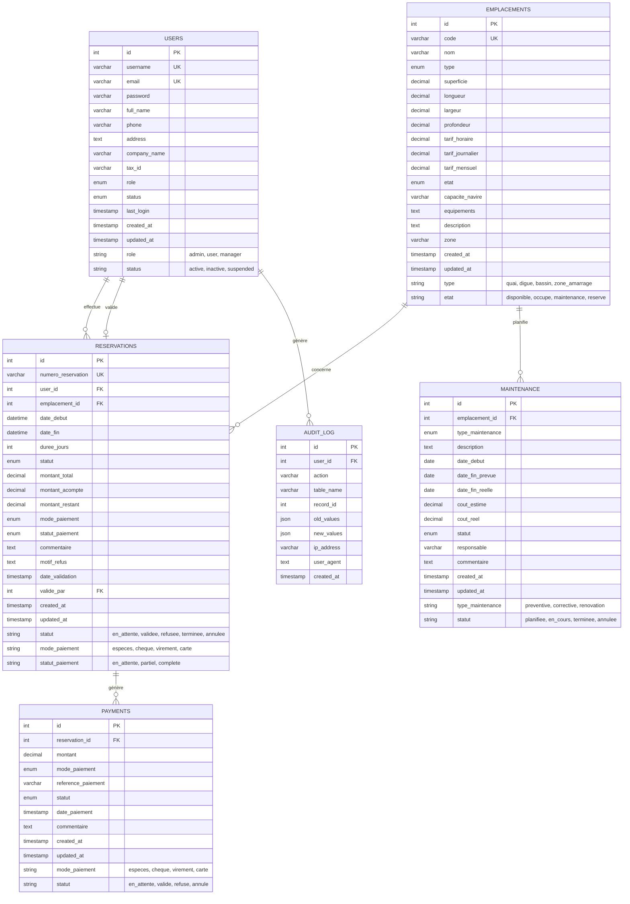
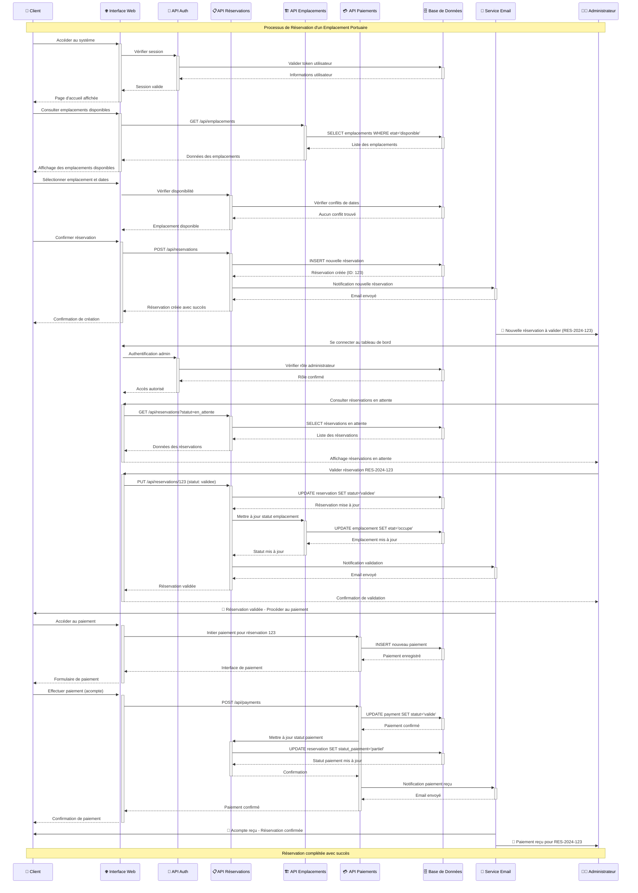
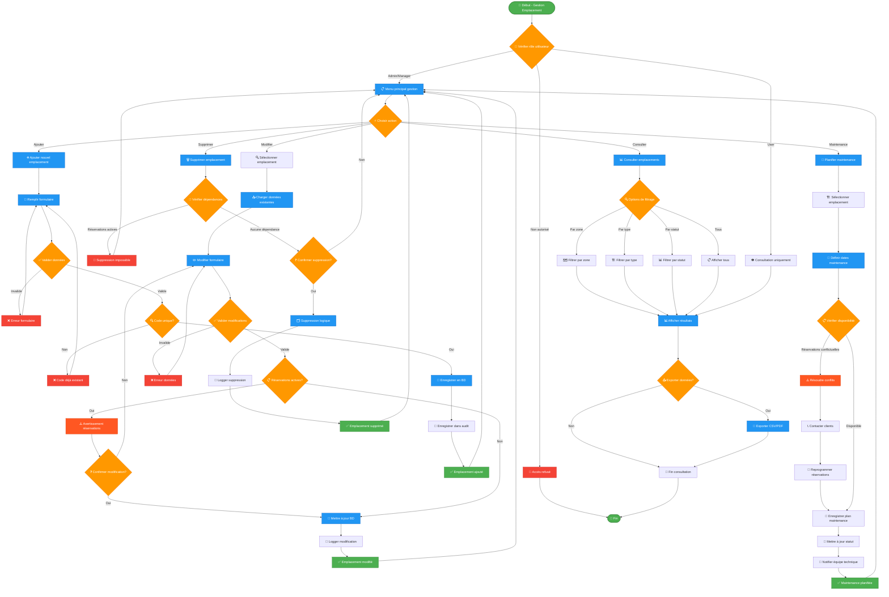

# Documentation UML - Système de Gestion des Emplacements Portuaires Marsa Maroc

Cette documentation présente les diagrammes UML complets du système de gestion des emplacements portuaires de Marsa Maroc, conçus pour la phase d'analyse et de conception du rapport de projet.

## Table des Matières

1. [Diagramme de Classes](#1-diagramme-de-classes)
2. [Diagramme de Cas d'Utilisation](#2-diagramme-de-cas-dutilisation)
3. [Diagramme Entité-Relation](#3-diagramme-entité-relation)
4. [Diagramme de Séquence](#4-diagramme-de-séquence)
5. [Diagramme d'Architecture](#5-diagramme-darchitecture)
6. [Diagramme d'États](#6-diagramme-détats)
7. [Diagramme d'Activité](#7-diagramme-dactivité)
8. [Diagramme de Composants](#8-diagramme-de-composants)

---

## 1. Diagramme de Classes

Ce diagramme présente les principales entités du système avec leurs attributs, méthodes et relations.

```mermaid
classDiagram
    class User {
        -int id
        -string username
        -string email
        -string password
        -string fullName
        -string phone
        -string address
        -string companyName
        -string taxId
        -UserRole role
        -UserStatus status
        -DateTime lastLogin
        -DateTime createdAt
        -DateTime updatedAt
        +authenticate(username, password) boolean
        +getAllUsers() Array
        +createUser(data) boolean
        +updateUser(id, data) boolean
        +deleteUser(id) boolean
        +validateCredentials(username, password) boolean
        +updateLastLogin(id) boolean
        +getByRole(role) Array
    }

    class Emplacement {
        -int id
        -string code
        -string nom
        -EmplacementType type
        -decimal superficie
        -decimal longueur
        -decimal largeur
        -decimal profondeur
        -decimal tarifHoraire
        -decimal tarifJournalier
        -decimal tarifMensuel
        -EmplacementEtat etat
        -string capaciteNavire
        -string equipements
        -string description
        -string zone
        -DateTime createdAt
        -DateTime updatedAt
        +getAllEmplacements() Array
        +getEmplacementById(id) Object
        +createEmplacement(data) boolean
        +updateEmplacement(id, data) boolean
        +deleteEmplacement(id) boolean
        +updateEtat(id, etat) boolean
        +getByZone(zone) Array
        +getAvailable() Array
        +calculatePrice(dateDebut, dateFin) decimal
    }

    class Reservation {
        -int id
        -string numeroReservation
        -int userId
        -int emplacementId
        -DateTime dateDebut
        -DateTime dateFin
        -int dureeJours
        -ReservationStatut statut
        -decimal montantTotal
        -decimal montantAcompte
        -decimal montantRestant
        -PaymentMode modePaiement
        -PaymentStatus statutPaiement
        -string commentaire
        -string motifRefus
        -DateTime dateValidation
        -int validePar
        -DateTime createdAt
        -DateTime updatedAt
        +getAllReservations() Array
        +getReservationById(id) Object
        +createReservation(data) boolean
        +updateReservation(id, data) boolean
        +deleteReservation(id) boolean
        +validateReservation(id, userId) boolean
        +refuseReservation(id, motif, userId) boolean
        +calculateMontant(emplacementId, dateDebut, dateFin) decimal
        +getByUser(userId) Array
        +getByEmplacement(emplacementId) Array
        +getByStatus(statut) Array
    }

    class Payment {
        -int id
        -int reservationId
        -decimal montant
        -PaymentMode modePaiement
        -string referencePaiement
        -PaymentStatus statut
        -DateTime datePaiement
        -string commentaire
        -DateTime createdAt
        -DateTime updatedAt
        +createPayment(data) boolean
        +updatePaymentStatus(id, statut) boolean
        +getByReservation(reservationId) Array
        +getTotalPaid(reservationId) decimal
    }

    class Database {
        -PDO pdo
        -Database instance
        -__construct()
        +getInstance() Database
        +getConnection() PDO
        +executeQuery(sql, params) Array
        +beginTransaction() boolean
        +commit() boolean
        +rollback() boolean
    }

    class AuthenticationService {
        +login(username, password) boolean
        +logout() boolean
        +checkSession() boolean
        +verifyRole(requiredRole) boolean
        +hashPassword(password) string
        +verifyPassword(password, hash) boolean
    }

    class EmplacementService {
        +getAvailableEmplacements(dateDebut, dateFin) Array
        +checkAvailability(emplacementId, dateDebut, dateFin) boolean
        +updateStatus(emplacementId, status) boolean
        +calculateOccupancyRate() decimal
        +getRevenueStats() Array
    }

    class ReservationService {
        +processReservation(data) boolean
        +validateDates(dateDebut, dateFin) boolean
        +checkConflicts(emplacementId, dateDebut, dateFin) boolean
        +generateReservationNumber() string
        +sendNotification(reservationId, type) boolean
        +generateInvoice(reservationId) Object
    }

    %% Énumérations
    class UserRole {
        <<enumeration>>
        ADMIN
        MANAGER
        USER
    }

    class UserStatus {
        <<enumeration>>
        ACTIVE
        INACTIVE
        SUSPENDED
    }

    class EmplacementType {
        <<enumeration>>
        QUAI
        DIGUE
        BASSIN
        ZONE_AMARRAGE
    }

    class EmplacementEtat {
        <<enumeration>>
        DISPONIBLE
        OCCUPE
        MAINTENANCE
        RESERVE
    }

    class ReservationStatut {
        <<enumeration>>
        EN_ATTENTE
        VALIDEE
        REFUSEE
        TERMINEE
        ANNULEE
    }

    class PaymentMode {
        <<enumeration>>
        ESPECES
        CHEQUE
        VIREMENT
        CARTE
    }

    class PaymentStatus {
        <<enumeration>>
        EN_ATTENTE
        PARTIEL
        COMPLETE
    }

    %% Relations
    User ||--o{ Reservation : "effectue"
    Emplacement ||--o{ Reservation : "concerne"
    Reservation ||--o{ Payment : "génère"
    User ||--o| Reservation : "valide"
    
    User -- UserRole
    User -- UserStatus
    Emplacement -- EmplacementType
    Emplacement -- EmplacementEtat
    Reservation -- ReservationStatut
    Reservation -- PaymentMode
    Payment -- PaymentMode
    Payment -- PaymentStatus

    AuthenticationService ..> User : "utilise"
    EmplacementService ..> Emplacement : "gère"
    ReservationService ..> Reservation : "traite"
    ReservationService ..> EmplacementService : "utilise"
    
    User ..> Database : "utilise"
    Emplacement ..> Database : "utilise"
    Reservation ..> Database : "utilise"
    Payment ..> Database : "utilise"
```

---

## 2. Diagramme de Cas d'Utilisation

Ce diagramme illustre les différents rôles d'utilisateurs et leurs interactions avec le système.

```mermaid
flowchart TB
    subgraph "Système de Gestion Portuaire Marsa Maroc"
        subgraph "Gestion des Utilisateurs"
            UC1[Créer un utilisateur]
            UC2[Modifier un utilisateur]
            UC3[Supprimer un utilisateur]
            UC4[Consulter les utilisateurs]
        end
        
        subgraph "Gestion des Emplacements"
            UC5[Ajouter un emplacement]
            UC6[Modifier un emplacement]
            UC7[Supprimer un emplacement]
            UC8[Consulter les emplacements]
            UC9[Mettre à jour l'état]
            UC10[Planifier la maintenance]
        end
        
        subgraph "Gestion des Réservations"
            UC11[Créer une réservation]
            UC12[Valider une réservation]
            UC13[Refuser une réservation]
            UC14[Consulter les réservations]
            UC15[Modifier une réservation]
            UC16[Annuler une réservation]
        end
        
        subgraph "Gestion des Paiements"
            UC17[Enregistrer un paiement]
            UC18[Consulter l'historique des paiements]
            UC19[Générer une facture]
        end
        
        subgraph "Rapports et Statistiques"
            UC20[Consulter les statistiques]
            UC21[Générer des rapports]
            UC22[Exporter des données]
            UC23[Analyser le taux d'occupation]
        end
        
        subgraph "Authentification"
            UC24[Se connecter]
            UC25[Se déconnecter]
            UC26[Gérer les sessions]
        end
    end
    
    %% Acteurs
    Admin[👨‍💼 Administrateur]
    Manager[👩‍💼 Gestionnaire]
    UserClient[👤 Utilisateur Client]
    System[🔧 Système]
    
    %% Relations Administrateur
    Admin --> UC1
    Admin --> UC2
    Admin --> UC3
    Admin --> UC4
    Admin --> UC5
    Admin --> UC6
    Admin --> UC7
    Admin --> UC8
    Admin --> UC9
    Admin --> UC10
    Admin --> UC12
    Admin --> UC13
    Admin --> UC14
    Admin --> UC15
    Admin --> UC16
    Admin --> UC17
    Admin --> UC18
    Admin --> UC19
    Admin --> UC20
    Admin --> UC21
    Admin --> UC22
    Admin --> UC23
    Admin --> UC24
    Admin --> UC25
    
    %% Relations Gestionnaire
    Manager --> UC4
    Manager --> UC8
    Manager --> UC9
    Manager --> UC10
    Manager --> UC11
    Manager --> UC12
    Manager --> UC13
    Manager --> UC14
    Manager --> UC15
    Manager --> UC16
    Manager --> UC17
    Manager --> UC18
    Manager --> UC19
    Manager --> UC20
    Manager --> UC21
    Manager --> UC22
    Manager --> UC23
    Manager --> UC24
    Manager --> UC25
    
    %% Relations Utilisateur Client
    UserClient --> UC8
    UserClient --> UC11
    UserClient --> UC14
    UserClient --> UC18
    UserClient --> UC24
    UserClient --> UC25
    
    %% Relations Système
    System --> UC26
    
    %% Inclusions
    UC11 -.->|includes| UC8
    UC12 -.->|includes| UC26
    UC13 -.->|includes| UC26
    UC17 -.->|includes| UC14
    UC19 -.->|includes| UC14
    UC20 -.->|includes| UC14
    UC21 -.->|includes| UC14
    
    %% Extensions
    UC15 -.->|extends| UC14
    UC16 -.->|extends| UC14
    UC22 -.->|extends| UC21
```



---

## 3. Diagramme Entité-Relation

Ce diagramme représente la structure de la base de données et les relations entre les tables.



---

## 4. Diagramme de Séquence

Ce diagramme démontre le flux du processus de réservation.



---

## 5. Diagramme d'Architecture

Ce diagramme montre l'architecture en couches du système.

```mermaid
flowchart TB
    subgraph "🌐 Couche Présentation"
        subgraph "Interface Utilisateur"
            WebBrowser[🌍 Navigateur Web]
            MobileApp[📱 Application Mobile]
            AdminDashboard[👨‍💼 Tableau de Bord Admin]
        end
        
        subgraph "Assets Statiques"
            CSS[🎨 CSS/Styles]
            JS[⚡ JavaScript]
            Images[🖼️ Images/Ressources]
        end
    end
    
    subgraph "🔄 Couche Logique Métier"
        subgraph "Contrôleurs Web"
            IndexController[🏠 Page d'Accueil]
            LoginController[🔐 Authentification]
            DashboardController[📊 Tableau de Bord]
        end
        
        subgraph "APIs REST"
            AuthAPI[🔐 API Authentification]
            UsersAPI[👥 API Utilisateurs]
            EmplacementsAPI[🏗️ API Emplacements]
            ReservationsAPI[📋 API Réservations]
            PaymentsAPI[💳 API Paiements]
            StatisticsAPI[📈 API Statistiques]
        end
        
        subgraph "Services Métier"
            AuthService[🔒 Service Authentification]
            UserService[👤 Service Utilisateurs]
            EmplacementService[🏗️ Service Emplacements]
            ReservationService[📋 Service Réservations]
            PaymentService[💰 Service Paiements]
            NotificationService[📧 Service Notifications]
            ReportService[📊 Service Rapports]
        end
    end
    
    subgraph "🗄️ Couche Accès aux Données"
        subgraph "Modèles de Données"
            UserModel[👤 Modèle Utilisateur]
            EmplacementModel[🏗️ Modèle Emplacement]
            ReservationModel[📋 Modèle Réservation]
            PaymentModel[💳 Modèle Paiement]
        end
        
        subgraph "Accès Base de Données"
            DatabaseConnection[🔌 Connexion DB]
            QueryBuilder[🔨 Constructeur Requêtes]
            TransactionManager[⚡ Gestionnaire Transactions]
        end
    end
    
    subgraph "💾 Couche Données"
        subgraph "Base de Données MySQL"
            UsersTable[(👥 Table Users)]
            EmplacementsTable[(🏗️ Table Emplacements)]
            ReservationsTable[(📋 Table Reservations)]
            PaymentsTable[(💳 Table Payments)]
            MaintenanceTable[(🔧 Table Maintenance)]
            AuditTable[(📝 Table Audit_Log)]
        end
        
        subgraph "Stockage Fichiers"
            LogFiles[📄 Fichiers de Log]
            ConfigFiles[⚙️ Fichiers de Config]
            BackupFiles[💾 Sauvegardes]
        end
    end
    
    subgraph "🔧 Services Externes"
        EmailServer[📧 Serveur Email]
        PaymentGateway[💳 Passerelle Paiement]
        SMSService[📱 Service SMS]
        BackupService[💾 Service Sauvegarde]
    end
    
    %% Connexions Couche Présentation
    WebBrowser --> IndexController
    WebBrowser --> LoginController
    AdminDashboard --> DashboardController
    MobileApp --> AuthAPI
    MobileApp --> ReservationsAPI
    
    %% Connexions Assets
    WebBrowser -.-> CSS
    WebBrowser -.-> JS
    WebBrowser -.-> Images
    
    %% Connexions Contrôleurs vers APIs
    IndexController --> EmplacementsAPI
    IndexController --> StatisticsAPI
    LoginController --> AuthAPI
    DashboardController --> UsersAPI
    DashboardController --> EmplacementsAPI
    DashboardController --> ReservationsAPI
    DashboardController --> StatisticsAPI
    
    %% Connexions APIs vers Services
    AuthAPI --> AuthService
    UsersAPI --> UserService
    EmplacementsAPI --> EmplacementService
    ReservationsAPI --> ReservationService
    PaymentsAPI --> PaymentService
    StatisticsAPI --> ReportService
    
    %% Connexions Services vers Modèles
    AuthService --> UserModel
    UserService --> UserModel
    EmplacementService --> EmplacementModel
    ReservationService --> ReservationModel
    ReservationService --> EmplacementModel
    PaymentService --> PaymentModel
    PaymentService --> ReservationModel
    
    %% Connexions Services Transversaux
    ReservationService --> NotificationService
    PaymentService --> NotificationService
    AuthService --> NotificationService
    
    %% Connexions Modèles vers Base de Données
    UserModel --> DatabaseConnection
    EmplacementModel --> DatabaseConnection
    ReservationModel --> DatabaseConnection
    PaymentModel --> DatabaseConnection
    
    %% Connexions Base de Données
    DatabaseConnection --> QueryBuilder
    DatabaseConnection --> TransactionManager
    QueryBuilder --> UsersTable
    QueryBuilder --> EmplacementsTable
    QueryBuilder --> ReservationsTable
    QueryBuilder --> PaymentsTable
    QueryBuilder --> MaintenanceTable
    QueryBuilder --> AuditTable
    
    %% Connexions Services Externes
    NotificationService --> EmailServer
    NotificationService --> SMSService
    PaymentService --> PaymentGateway
    ReportService --> BackupService
    
    %% Connexions Fichiers
    DatabaseConnection -.-> LogFiles
    DatabaseConnection -.-> ConfigFiles
    BackupService -.-> BackupFiles
    
    %% Styles
    classDef presentationLayer fill:#e1f5fe
    classDef businessLayer fill:#f3e5f5
    classDef dataAccessLayer fill:#e8f5e8
    classDef dataLayer fill:#fff3e0
    classDef externalLayer fill:#fce4ec
    
    class WebBrowser,MobileApp,AdminDashboard,CSS,JS,Images presentationLayer
    class IndexController,LoginController,DashboardController,AuthAPI,UsersAPI,EmplacementsAPI,ReservationsAPI,PaymentsAPI,StatisticsAPI,AuthService,UserService,EmplacementService,ReservationService,PaymentService,NotificationService,ReportService businessLayer
    class UserModel,EmplacementModel,ReservationModel,PaymentModel,DatabaseConnection,QueryBuilder,TransactionManager dataAccessLayer
    class UsersTable,EmplacementsTable,ReservationsTable,PaymentsTable,MaintenanceTable,AuditTable,LogFiles,ConfigFiles,BackupFiles dataLayer
    class EmailServer,PaymentGateway,SMSService,BackupService externalLayer
```



---

## 6. Diagramme d'États

Ce diagramme représente les différents états des réservations et leurs transitions.

```mermaid
stateDiagram-v2
    [*] --> EnAttente : Création réservation
    
    state "🕐 En Attente" as EnAttente {
        EnAttente : Réservation créée par le client
        EnAttente : En attente de validation admin
        EnAttente : Emplacement temporairement réservé
    }
    
    state "✅ Validée" as Validee {
        Validee : Réservation approuvée par admin
        Validee : Emplacement marqué comme occupé
        Validee : Client peut procéder au paiement
    }
    
    state "❌ Refusée" as Refusee {
        Refusee : Réservation rejetée par admin
        Refusee : Motif de refus fourni
        Refusee : Emplacement libéré
    }
    
    state "🏁 Terminée" as Terminee {
        Terminee : Période de réservation écoulée
        Terminee : Paiement complété
        Terminee : Emplacement libéré
    }
    
    state "🚫 Annulée" as Annulee {
        Annulee : Annulation par le client
        Annulee : Annulation par admin
        Annulee : Remboursement si applicable
    }
    
    %% Transitions principales
    EnAttente --> Validee : Validation admin
    EnAttente --> Refusee : Refus admin
    EnAttente --> Annulee : Annulation client/admin
    
    Validee --> Terminee : Fin période + Paiement complet
    Validee --> Annulee : Annulation exceptionnelle
    
    %% Transitions de retour (cas exceptionnels)
    Refusee --> EnAttente : Reconsidération admin
    
    %% Transitions finales
    Refusee --> [*] : Archivage
    Terminee --> [*] : Archivage
    Annulee --> [*] : Archivage
    
    %% Notes sur les conditions
    note right of EnAttente
        Conditions de validation :
        - Emplacement disponible
        - Dates valides
        - Informations complètes
    end note
    
    note right of Validee
        Conditions de finalisation :
        - Paiement effectué
        - Période respectée
        - Aucun incident
    end note
    
    note right of Refusee
        Motifs de refus :
        - Conflit de dates
        - Emplacement indisponible
        - Informations incorrectes
    end note
```

---

## 7. Diagramme d'Activité

Ce diagramme illustre le workflow de gestion des emplacements portuaires.



---

## 8. Diagramme de Composants

Ce diagramme montre les composants du système et leurs dépendances.

```mermaid
flowchart TB
    subgraph "📱 Frontend Components"
        subgraph "🌐 Web Interface"
            WebUI[🖥️ Interface Web Principal]
            AdminPanel[👨‍💼 Panneau Admin]
            UserPortal[👤 Portail Utilisateur]
        end
        
        subgraph "📱 Mobile Components"
            MobileApp[📱 Application Mobile]
            PWA[🔄 Progressive Web App]
        end
        
        subgraph "🎨 UI Components"
            Dashboard[📊 Tableau de Bord]
            Forms[📝 Formulaires]
            Tables[📋 Tables de Données]
            Charts[📈 Graphiques]
            Modals[🪟 Fenêtres Modales]
        end
    end
    
    subgraph "⚙️ Backend Components"
        subgraph "🔄 API Layer"
            APIGateway[🚪 Passerelle API]
            AuthAPI[🔐 API Authentification]
            UserAPI[👥 API Utilisateurs]
            EmplacementAPI[🏗️ API Emplacements]
            ReservationAPI[📋 API Réservations]
            PaymentAPI[💳 API Paiements]
            StatAPI[📊 API Statistiques]
        end
        
        subgraph "💼 Business Logic"
            AuthService[🔒 Service Auth]
            UserService[👤 Service Utilisateur]
            EmplacementService[🏗️ Service Emplacement]
            ReservationService[📋 Service Réservation]
            PaymentService[💰 Service Paiement]
            NotificationService[📧 Service Notification]
            ReportService[📊 Service Rapport]
            ValidationService[✅ Service Validation]
        end
        
        subgraph "🗄️ Data Access"
            UserDAO[👤 DAO Utilisateur]
            EmplacementDAO[🏗️ DAO Emplacement]
            ReservationDAO[📋 DAO Réservation]
            PaymentDAO[💳 DAO Paiement]
            AuditDAO[📝 DAO Audit]
        end
    end
    
    subgraph "🔧 Infrastructure Components"
        subgraph "💾 Database"
            MySQL[🐬 MySQL Database]
            ConnectionPool[🏊 Pool de Connexions]
            QueryOptimizer[⚡ Optimiseur Requêtes]
        end
        
        subgraph "🌐 External Services"
            EmailServer[📧 Serveur Email]
            SMSGateway[📱 Passerelle SMS]
            PaymentGateway[💳 Passerelle Paiement]
            FileStorage[📁 Stockage Fichiers]
        end
        
        subgraph "🔒 Security"
            Authentication[🔐 Authentification]
            Authorization[🛡️ Autorisation]
            Encryption[🔒 Chiffrement]
            AuditLogger[📝 Logger Audit]
        end
        
        subgraph "📊 Monitoring"
            Logger[📋 Logger Système]
            PerformanceMonitor[⚡ Monitoring Performance]
            ErrorTracker[🚨 Suivi Erreurs]
        end
    end
    
    %% Dependencies Frontend
    WebUI --> APIGateway
    AdminPanel --> APIGateway
    UserPortal --> APIGateway
    MobileApp --> APIGateway
    PWA --> APIGateway
    
    Dashboard --> WebUI
    Forms --> WebUI
    Tables --> WebUI
    Charts --> WebUI
    Modals --> WebUI
    
    %% Dependencies API Layer
    APIGateway --> AuthAPI
    APIGateway --> UserAPI
    APIGateway --> EmplacementAPI
    APIGateway --> ReservationAPI
    APIGateway --> PaymentAPI
    APIGateway --> StatAPI
    
    %% Dependencies Business Logic
    AuthAPI --> AuthService
    UserAPI --> UserService
    EmplacementAPI --> EmplacementService
    ReservationAPI --> ReservationService
    PaymentAPI --> PaymentService
    StatAPI --> ReportService
    
    ReservationService --> NotificationService
    PaymentService --> NotificationService
    UserService --> ValidationService
    EmplacementService --> ValidationService
    ReservationService --> ValidationService
    
    %% Dependencies Data Access
    AuthService --> UserDAO
    UserService --> UserDAO
    EmplacementService --> EmplacementDAO
    ReservationService --> ReservationDAO
    ReservationService --> EmplacementDAO
    PaymentService --> PaymentDAO
    ReportService --> UserDAO
    ReportService --> EmplacementDAO
    ReportService --> ReservationDAO
    ReportService --> PaymentDAO
    
    %% All DAOs depend on Database
    UserDAO --> ConnectionPool
    EmplacementDAO --> ConnectionPool
    ReservationDAO --> ConnectionPool
    PaymentDAO --> ConnectionPool
    AuditDAO --> ConnectionPool
    
    ConnectionPool --> MySQL
    ConnectionPool --> QueryOptimizer
    
    %% Security Dependencies
    AuthService --> Authentication
    APIGateway --> Authentication
    APIGateway --> Authorization
    PaymentService --> Encryption
    AuditDAO --> AuditLogger
    
    %% External Service Dependencies
    NotificationService --> EmailServer
    NotificationService --> SMSGateway
    PaymentService --> PaymentGateway
    ReportService --> FileStorage
    
    %% Monitoring Dependencies
    APIGateway --> Logger
    AuthService --> Logger
    UserService --> Logger
    EmplacementService --> Logger
    ReservationService --> Logger
    PaymentService --> Logger
    
    APIGateway --> PerformanceMonitor
    MySQL --> PerformanceMonitor
    
    APIGateway --> ErrorTracker
    AuthService --> ErrorTracker
    UserService --> ErrorTracker
    EmplacementService --> ErrorTracker
    ReservationService --> ErrorTracker
    PaymentService --> ErrorTracker
    
    %% Security cross-cutting concerns
    Authentication -.-> UserDAO
    Authorization -.-> EmplacementDAO
    Authorization -.-> ReservationDAO
    Authorization -.-> PaymentDAO
    AuditLogger -.-> AuditDAO
    
    %% Component Styles
    classDef frontend fill:#e3f2fd,stroke:#1976d2,color:#000
    classDef api fill:#f3e5f5,stroke:#7b1fa2,color:#000
    classDef business fill:#e8f5e8,stroke:#388e3c,color:#000
    classDef data fill:#fff3e0,stroke:#f57c00,color:#000
    classDef infrastructure fill:#fce4ec,stroke:#c2185b,color:#000
    classDef security fill:#ffebee,stroke:#d32f2f,color:#000
    
    class WebUI,AdminPanel,UserPortal,MobileApp,PWA,Dashboard,Forms,Tables,Charts,Modals frontend
    class APIGateway,AuthAPI,UserAPI,EmplacementAPI,ReservationAPI,PaymentAPI,StatAPI api
    class AuthService,UserService,EmplacementService,ReservationService,PaymentService,NotificationService,ReportService,ValidationService business
    class UserDAO,EmplacementDAO,ReservationDAO,PaymentDAO,AuditDAO,MySQL,ConnectionPool,QueryOptimizer data
    class EmailServer,SMSGateway,PaymentGateway,FileStorage,Logger,PerformanceMonitor,ErrorTracker infrastructure
    class Authentication,Authorization,Encryption,AuditLogger security
```



---

## Conclusion

Cette documentation UML complète fournit une vue d'ensemble détaillée du système de gestion des emplacements portuaires de Marsa Maroc. Les diagrammes présentés couvrent tous les aspects architecturaux et fonctionnels du système :

### 🎯 Points Clés de l'Architecture

1. **Architecture en Couches** : Séparation claire entre présentation, logique métier et accès aux données
2. **API REST** : Interface standardisée pour tous les échanges de données
3. **Sécurité Robuste** : Authentification, autorisation et audit complets
4. **Gestion d'États** : Workflow de réservation bien défini avec transitions contrôlées
5. **Modularité** : Composants découplés et réutilisables

### 📊 Entités Principales

- **Utilisateurs** : Gestion des rôles (Admin, Manager, User) avec permissions granulaires
- **Emplacements** : Types variés (quai, digue, bassin) avec états de disponibilité
- **Réservations** : Cycle de vie complet de la demande à la finalisation
- **Paiements** : Suivi des transactions et des modes de paiement

### 🔄 Processus Métier

Le système gère efficacement les processus critiques :
- Réservation d'emplacements avec validation administrative
- Gestion des conflits et de la disponibilité
- Suivi des paiements et génération de factures
- Maintenance préventive et corrective des emplacements
- Reporting et analyse statistique

Cette documentation servira de référence pour la phase de développement et de maintenance du système, assurant une compréhension claire de l'architecture et des fonctionnalités pour toutes les parties prenantes du projet.