# Documentation UML - Système de Gestion des Emplacements Portuaires Marsa Maroc

## Table des Matières

1. [Diagramme de Cas d'Usage](#1-diagramme-de-cas-dusage)
2. [Diagramme de Classes](#2-diagramme-de-classes)
3. [Diagramme de Séquence](#3-diagramme-de-séquence)
4. [Diagramme d'États](#4-diagramme-détats)
5. [Diagramme d'Activité](#5-diagramme-dactivité)
6. [Diagramme de Composants](#6-diagramme-de-composants)
7. [Diagramme Entité-Relation](#7-diagramme-entité-relation)

---

## 1. Diagramme de Cas d'Usage

**Description**: Représentation des interactions entre les différents acteurs et le système de gestion portuaire.

```mermaid
flowchart LR
    %% Acteurs à gauche
    subgraph Acteurs
        Admin[👤 Administrateur]
        Manager[👤 Manager] 
        User[👤 Utilisateur]
    end
    
    %% Système au centre
    subgraph System["🏢 Système de Gestion Portuaire Marsa Maroc"]
        
        subgraph Auth["🔐 Authentification"]
            UC1((Se connecter))
            UC2((Se déconnecter))
        end
        
        subgraph Emplacements["🚢 Gestion Emplacements"]
            UC3((Consulter emplacements))
            UC4((Ajouter emplacement))
            UC5((Modifier emplacement))
            UC6((Supprimer emplacement))
            UC7((Changer état))
        end
        
        subgraph Reservations["📋 Gestion Réservations"]
            UC8((Demander réservation))
            UC9((Consulter réservations))
            UC10((Valider réservation))
            UC11((Refuser réservation))
            UC12((Annuler réservation))
        end
        
        subgraph Users["👥 Gestion Utilisateurs"]
            UC13((Consulter profil))
            UC14((Modifier profil))
            UC15((Créer utilisateur))
            UC16((Modifier utilisateur))
            UC17((Supprimer utilisateur))
        end
        
        subgraph Stats["📊 Statistiques"]
            UC18((Consulter statistiques))
            UC19((Générer rapports))
        end
    end
    
    %% Relations Administrateur (accès complet)
    Admin --- UC1
    Admin --- UC2
    Admin --- UC3
    Admin --- UC4
    Admin --- UC5
    Admin --- UC6
    Admin --- UC7
    Admin --- UC9
    Admin --- UC10
    Admin --- UC11
    Admin --- UC13
    Admin --- UC14
    Admin --- UC15
    Admin --- UC16
    Admin --- UC17
    Admin --- UC18
    Admin --- UC19
    
    %% Relations Manager (accès limité)
    Manager --- UC1
    Manager --- UC2
    Manager --- UC3
    Manager --- UC7
    Manager --- UC9
    Manager --- UC10
    Manager --- UC11
    Manager --- UC13
    Manager --- UC14
    Manager --- UC18
    
    %% Relations Utilisateur (accès minimal)
    User --- UC1
    User --- UC2
    User --- UC3
    User --- UC8
    User --- UC9
    User --- UC12
    User --- UC13
    User --- UC14
    
    %% Styles
    classDef actor fill:#e1f5fe,stroke:#01579b,stroke-width:2px
    classDef usecase fill:#f3e5f5,stroke:#4a148c,stroke-width:2px
    classDef system fill:#e8f5e8,stroke:#1b5e20,stroke-width:2px
    
    class Admin,Manager,User actor
    class UC1,UC2,UC3,UC4,UC5,UC6,UC7,UC8,UC9,UC10,UC11,UC12,UC13,UC14,UC15,UC16,UC17,UC18,UC19 usecase
```



---

## 2. Diagramme de Classes

**Description**: Structure des classes principales du système avec leurs attributs, méthodes et relations.

```mermaid
classDiagram
    class User {
        -int id
        -string username
        -string email
        -string password
        -string full_name
        -string phone
        -string address
        -string company_name
        -string tax_id
        -UserRole role
        -UserStatus status
        -datetime last_login
        -datetime created_at
        -datetime updated_at
        +login() bool
        +logout() void
        +updateProfile() bool
        +getReservations() Reservation[]
    }
    
    class Emplacement {
        -int id
        -string code
        -string nom
        -EmplacementType type
        -decimal superficie
        -decimal longueur
        -decimal largeur
        -decimal profondeur
        -decimal tarif_horaire
        -decimal tarif_journalier
        -decimal tarif_mensuel
        -EmplacementEtat etat
        -int capacite_navire
        -string equipements
        -string description
        -datetime created_at
        -datetime updated_at
        +isAvailable() bool
        +calculateCost(duration) decimal
        +changeState(newState) void
        +getReservations() Reservation[]
    }
    
    class Reservation {
        -int id
        -int user_id
        -int emplacement_id
        -date date_debut
        -date date_fin
        -int duree_jours
        -ReservationStatut statut
        -decimal montant_total
        -decimal montant_paye
        -decimal montant_restant
        -PaymentMethod methode_paiement
        -string commentaire
        -datetime created_at
        -datetime updated_at
        +calculateDuration() int
        +calculateAmount() decimal
        +validate() bool
        +refuse() bool
        +cancel() bool
        +addPayment(amount) bool
    }
    
    class Payment {
        -int id
        -int reservation_id
        -decimal montant
        -PaymentMethod methode
        -PaymentStatus statut
        -string reference
        -datetime date_paiement
        -string commentaire
        +process() bool
        +refund() bool
    }
    
    %% Énumérations
    class UserRole {
        <<enumeration>>
        ADMIN
        USER
        MANAGER
    }
    
    class UserStatus {
        <<enumeration>>
        ACTIVE
        INACTIVE
        SUSPENDED
    }
    
    class EmplacementType {
        <<enumeration>>
        QUAI
        DIGUE
        BASSIN
        ZONE_AMARRAGE
    }
    
    class EmplacementEtat {
        <<enumeration>>
        DISPONIBLE
        OCCUPE
        MAINTENANCE
        RESERVE
    }
    
    class ReservationStatut {
        <<enumeration>>
        EN_ATTENTE
        VALIDEE
        REFUSEE
        TERMINEE
        ANNULEE
    }
    
    class PaymentMethod {
        <<enumeration>>
        ESPECES
        CHEQUE
        VIREMENT
        CARTE_CREDIT
    }
    
    class PaymentStatus {
        <<enumeration>>
        EN_ATTENTE
        VALIDEE
        REFUSEE
    }
    
    %% Relations
    User ||--o{ Reservation : fait
    Emplacement ||--o{ Reservation : concerne
    Reservation ||--o{ Payment : génère
    User }o--|| UserRole : a
    User }o--|| UserStatus : a
    Emplacement }o--|| EmplacementType : est
    Emplacement }o--|| EmplacementEtat : dans
    Reservation }o--|| ReservationStatut : a
    Payment }o--|| PaymentMethod : utilise
    Payment }o--|| PaymentStatus : a
```

---

## 3. Diagramme de Séquence

**Description**: Processus de création d'une réservation avec validation.

```mermaid
sequenceDiagram
    participant U as Utilisateur
    participant Web as Interface Web
    participant API as API Controller
    participant Auth as Service Auth
    participant DB as Base de Données
    participant Email as Service Email
    
    U->>Web: Sélectionner emplacement
    Web->>API: GET /emplacements/{id}
    API->>DB: Vérifier disponibilité
    DB-->>API: Données emplacement
    API-->>Web: Informations emplacement
    Web-->>U: Afficher formulaire réservation
    
    U->>Web: Soumettre demande réservation
    Web->>API: POST /reservations
    API->>Auth: Vérifier session utilisateur
    Auth-->>API: Utilisateur authentifié
    
    API->>DB: Vérifier disponibilité dates
    alt Dates disponibles
        DB-->>API: Disponible
        API->>DB: Calculer montant total
        DB-->>API: Montant calculé
        API->>DB: Créer réservation (statut: en_attente)
        DB-->>API: Réservation créée
        API->>Email: Notifier admin nouvelle demande
        API-->>Web: Succès - Réservation en attente
        Web-->>U: Confirmation demande envoyée
    else Dates non disponibles
        DB-->>API: Non disponible
        API-->>Web: Erreur - Dates occupées
        Web-->>U: Message d'erreur
    end
    
    note over API,Email: Processus de validation par admin
    API->>DB: Récupérer demandes en attente
    DB-->>API: Liste demandes
    API->>DB: Valider réservation
    DB-->>API: Statut mis à jour
    API->>Email: Notifier utilisateur validation
```



---

## 4. Diagramme d'États

**Description**: États et transitions des réservations dans le système.

```mermaid
stateDiagram-v2
    [*] --> EN_ATTENTE : Utilisateur soumet demande
    
    state "🔄 En Attente de Validation" as EN_ATTENTE {
        state "Nouvelle demande" as Nouveau
        state "En cours d'examen" as EnRevision
        [*] --> Nouveau
        Nouveau --> EnRevision : Admin examine la demande
    }
    
    EN_ATTENTE --> VALIDEE : Admin approuve\n[conditions remplies]
    EN_ATTENTE --> REFUSEE : Admin refuse\n[conditions non remplies]
    EN_ATTENTE --> ANNULEE : Utilisateur annule\n[avant validation]
    
    state "✅ Réservation Validée" as VALIDEE {
        state "Active et en cours" as Active
        state "Paiement partiel effectué" as PaiementPartiel
        state "Paiement complet" as PaiementComplet
        [*] --> Active
        Active --> PaiementPartiel : Paiement reçu\n[montant < total]
        PaiementPartiel --> PaiementComplet : Solde payé\n[montant = total]
        Active --> PaiementComplet : Paiement complet\n[montant = total]
    }
    
    VALIDEE --> TERMINEE : Date fin atteinte\n[réservation expirée]
    VALIDEE --> ANNULEE : Annulation exceptionnelle\n[cas spéciaux]
    
    state "❌ Réservation Refusée" as REFUSEE {
        state "Motif de refus documenté" as RefuseDetails
        [*] --> RefuseDetails
    }
    
    state "🚫 Réservation Annulée" as ANNULEE {
        state "Remboursement en cours" as Remboursement
        state "Processus terminé" as AnnulationComplete
        [*] --> Remboursement : Si paiement effectué
        [*] --> AnnulationComplete : Si aucun paiement
        Remboursement --> AnnulationComplete : Remboursement effectué
    }
    
    state "✔️ Réservation Terminée" as TERMINEE {
        state "Terminée avec succès" as Completed
        state "Archivée" as Archived
        [*] --> Completed
        Completed --> Archived : Après 30 jours
    }
    
    REFUSEE --> [*] : Processus terminé
    ANNULEE --> [*] : Processus terminé  
    TERMINEE --> [*] : Données archivées
    
    note right of EN_ATTENTE
        Validation obligatoire par
        administrateur ou manager
        selon les règles métier
    end note
    
    note right of VALIDEE
        Suivi des paiements
        partiels ou complets
        selon accord client
    end note
    
    note left of TERMINEE
        Archivage automatique
        pour historique et
        génération de rapports
    end note
```



---

## 5. Diagramme d'Activité

**Description**: Processus complet de gestion d'une demande de réservation.

```mermaid
flowchart TD
    Start([Début: Nouvelle demande]) --> CheckAuth{Utilisateur connecté?}
    CheckAuth -->|Non| Login[Page de connexion]
    Login --> CheckAuth
    CheckAuth -->|Oui| SelectLocation[Sélectionner emplacement]
    
    SelectLocation --> CheckAvailability{Emplacement disponible?}
    CheckAvailability -->|Non| ShowError[Afficher message d'erreur]
    ShowError --> SelectLocation
    
    CheckAvailability -->|Oui| FillForm[Remplir formulaire réservation]
    FillForm --> ValidateForm{Formulaire valide?}
    ValidateForm -->|Non| ShowValidationError[Afficher erreurs validation]
    ShowValidationError --> FillForm
    
    ValidateForm -->|Oui| SubmitRequest[Soumettre demande]
    SubmitRequest --> SaveToDB[(Sauvegarder en base)]
    SaveToDB --> NotifyAdmin[Notifier administrateur]
    NotifyAdmin --> ConfirmUser[Confirmer à l'utilisateur]
    
    ConfirmUser --> WaitValidation[Attente validation admin]
    WaitValidation --> AdminDecision{Décision admin}
    
    AdminDecision -->|Valider| ValidateReservation[Valider réservation]
    AdminDecision -->|Refuser| RefuseReservation[Refuser réservation]
    
    ValidateReservation --> UpdateStatus1[(Mettre à jour statut: VALIDEE)]
    UpdateStatus1 --> NotifyUserApproval[Notifier utilisateur - Approuvée]
    NotifyUserApproval --> ProcessPayment[Traiter paiement]
    
    RefuseReservation --> UpdateStatus2[(Mettre à jour statut: REFUSEE)]
    UpdateStatus2 --> NotifyUserRefusal[Notifier utilisateur - Refusée]
    NotifyUserRefusal --> End1([Fin: Demande refusée])
    
    ProcessPayment --> PaymentComplete{Paiement complet?}
    PaymentComplete -->|Non| PartialPayment[Paiement partiel]
    PaymentComplete -->|Oui| CompletePayment[Paiement complet]
    
    PartialPayment --> WaitRemainingPayment[Attendre solde]
    WaitRemainingPayment --> PaymentComplete
    
    CompletePayment --> StartReservation[Démarrer réservation]
    StartReservation --> MonitorReservation[Suivre réservation]
    MonitorReservation --> CheckEndDate{Date fin atteinte?}
    
    CheckEndDate -->|Non| MonitorReservation
    CheckEndDate -->|Oui| EndReservation[Terminer réservation]
    EndReservation --> UpdateStatus3[(Mettre à jour statut: TERMINEE)]
    UpdateStatus3 --> End2([Fin: Réservation terminée])
    
    %% Styles
    classDef startEnd fill:#90EE90
    classDef process fill:#87CEEB
    classDef decision fill:#FFB6C1
    classDef database fill:#DDA0DD
    
    class Start,End1,End2 startEnd
    class SelectLocation,FillForm,SubmitRequest,ValidateReservation,RefuseReservation,ProcessPayment,StartReservation,EndReservation process
    class CheckAuth,CheckAvailability,ValidateForm,AdminDecision,PaymentComplete,CheckEndDate decision
    class SaveToDB,UpdateStatus1,UpdateStatus2,UpdateStatus3 database
```



---

## 6. Diagramme de Composants

**Description**: Architecture des composants du système de gestion portuaire.

```mermaid
flowchart TB
    subgraph "Couche Présentation"
        WebUI[Interface Web]
        AdminPanel[Panneau Admin]
        UserDash[Tableau de bord Utilisateur]
    end
    
    subgraph "Couche Application"
        AuthController[Contrôleur Auth]
        UserController[Contrôleur Utilisateurs]
        EmplacementController[Contrôleur Emplacements]
        ReservationController[Contrôleur Réservations]
        StatsController[Contrôleur Statistiques]
    end
    
    subgraph "Couche Services"
        AuthService[Service Authentification]
        EmailService[Service Email]
        PaymentService[Service Paiement]
        ReportService[Service Rapports]
    end
    
    subgraph "Couche Données"
        UserDAO[DAO Utilisateurs]
        EmplacementDAO[DAO Emplacements]
        ReservationDAO[DAO Réservations]
        PaymentDAO[DAO Paiements]
    end
    
    subgraph "Base de Données"
        MySQL[(MySQL Database)]
    end
    
    subgraph "Services Externes"
        EmailProvider[Fournisseur Email]
        PaymentGateway[Passerelle Paiement]
    end
    
    %% Connexions Présentation -> Application
    WebUI --> AuthController
    WebUI --> UserController
    WebUI --> EmplacementController
    WebUI --> ReservationController
    
    AdminPanel --> UserController
    AdminPanel --> EmplacementController
    AdminPanel --> ReservationController
    AdminPanel --> StatsController
    
    UserDash --> AuthController
    UserDash --> ReservationController
    UserDash --> EmplacementController
    
    %% Connexions Application -> Services
    AuthController --> AuthService
    UserController --> EmailService
    ReservationController --> EmailService
    ReservationController --> PaymentService
    StatsController --> ReportService
    
    %% Connexions Contrôleurs -> DAO
    AuthController --> UserDAO
    UserController --> UserDAO
    EmplacementController --> EmplacementDAO
    ReservationController --> ReservationDAO
    ReservationController --> PaymentDAO
    StatsController --> UserDAO
    StatsController --> EmplacementDAO
    StatsController --> ReservationDAO
    
    %% Connexions DAO -> Base de données
    UserDAO --> MySQL
    EmplacementDAO --> MySQL
    ReservationDAO --> MySQL
    PaymentDAO --> MySQL
    
    %% Connexions Services -> Externes
    EmailService --> EmailProvider
    PaymentService --> PaymentGateway
```



---

## 7. Diagramme Entité-Relation

**Description**: Modèle de données complet du système de gestion portuaire.

```mermaid
erDiagram
    USERS {
        INT id PK "Clé primaire"
        VARCHAR username UK "Nom d'utilisateur unique"
        VARCHAR email UK "Email unique"
        VARCHAR password "Mot de passe hashé"
        VARCHAR full_name "Nom complet"
        VARCHAR phone "Téléphone"
        TEXT address "Adresse"
        VARCHAR company_name "Nom entreprise"
        VARCHAR tax_id "Numéro fiscal"
        ENUM role "admin, user, manager"
        ENUM status "active, inactive, suspended"
        TIMESTAMP last_login "Dernière connexion"
        TIMESTAMP created_at "Date création"
        TIMESTAMP updated_at "Date modification"
    }
    
    EMPLACEMENTS {
        INT id PK "Clé primaire"
        VARCHAR code UK "Code emplacement unique"
        VARCHAR nom "Nom emplacement"
        ENUM type "quai, digue, bassin, zone_amarrage"
        DECIMAL superficie "Superficie en m²"
        DECIMAL longueur "Longueur en m"
        DECIMAL largeur "Largeur en m"
        DECIMAL profondeur "Profondeur en m"
        DECIMAL tarif_horaire "Tarif horaire"
        DECIMAL tarif_journalier "Tarif journalier"
        DECIMAL tarif_mensuel "Tarif mensuel"
        ENUM etat "disponible, occupe, maintenance, reserve"
        INT capacite_navire "Capacité max navire"
        TEXT equipements "Équipements disponibles"
        TEXT description "Description"
        TIMESTAMP created_at "Date création"
        TIMESTAMP updated_at "Date modification"
    }
    
    RESERVATIONS {
        INT id PK "Clé primaire"
        INT user_id FK "Référence utilisateur"
        INT emplacement_id FK "Référence emplacement"
        DATE date_debut "Date début réservation"
        DATE date_fin "Date fin réservation"
        INT duree_jours "Durée en jours"
        ENUM statut "en_attente, validee, refusee, terminee, annulee"
        DECIMAL montant_total "Montant total"
        DECIMAL montant_paye "Montant payé"
        DECIMAL montant_restant "Montant restant"
        ENUM methode_paiement "especes, cheque, virement, carte_credit"
        TEXT commentaire "Commentaire"
        TIMESTAMP created_at "Date création"
        TIMESTAMP updated_at "Date modification"
    }
    
    PAYMENTS {
        INT id PK "Clé primaire"
        INT reservation_id FK "Référence réservation"
        DECIMAL montant "Montant paiement"
        ENUM methode "especes, cheque, virement, carte_credit"
        ENUM statut "en_attente, validee, refusee"
        VARCHAR reference "Référence paiement"
        TIMESTAMP date_paiement "Date paiement"
        TEXT commentaire "Commentaire"
        TIMESTAMP created_at "Date création"
    }
    
    AUDIT_LOG {
        INT id PK "Clé primaire"
        INT user_id FK "Utilisateur responsable"
        VARCHAR table_name "Table modifiée"
        INT record_id "ID enregistrement"
        ENUM action "CREATE, UPDATE, DELETE"
        JSON old_values "Anciennes valeurs"
        JSON new_values "Nouvelles valeurs"
        TIMESTAMP created_at "Date action"
    }
    
    %% Relations
    USERS ||--o{ RESERVATIONS : "fait"
    EMPLACEMENTS ||--o{ RESERVATIONS : "concerne"
    RESERVATIONS ||--o{ PAYMENTS : "génère"
    USERS ||--o{ AUDIT_LOG : "déclenche"
    
    %% Contraintes
    USERS {
        CHECK username_length "LENGTH(username) >= 3"
        CHECK email_format "email LIKE '%@%.%'"
        CHECK phone_format "phone REGEXP '^[0-9+\\-\\s]+$'"
    }
    
    EMPLACEMENTS {
        CHECK superficie_positive "superficie > 0"
        CHECK tarifs_positifs "tarif_horaire > 0 AND tarif_journalier > 0"
        CHECK dimensions_coherentes "longueur > 0 AND largeur > 0"
    }
    
    RESERVATIONS {
        CHECK dates_coherentes "date_fin > date_debut"
        CHECK montants_positifs "montant_total > 0"
        CHECK montant_paye_valide "montant_paye <= montant_total"
    }
    
    PAYMENTS {
        CHECK montant_positif "montant > 0"
    }
```



---

## Notes Techniques

### Compatibilité Mermaid

- **Version Mermaid**: Compatible avec mermaid.js v9.0.0+
- **Rendu GitHub**: Tous les diagrammes sont optimisés pour le rendu GitHub
- **Export**: Compatible avec mermaid.live pour export PDF/PNG
- **Syntaxe**: Utilisation de la syntaxe Mermaid standard sans extensions

### Conventions de Style

- **Classes CSS**: Styles intégrés pour une meilleure lisibilité
- **Couleurs**: Palette cohérente basée sur les types d'éléments
- **Flèches**: Types appropriés selon les relations (composition, agrégation, etc.)
- **Libellés**: En français conformément aux spécifications du projet

### Maintenance

Ce document doit être mis à jour lors de :
- Ajout de nouvelles fonctionnalités
- Modification du modèle de données
- Changements dans l'architecture
- Évolution des processus métier

---

*Dernière mise à jour: [Date actuelle]*
*Système: Marsa Maroc Port Management System*